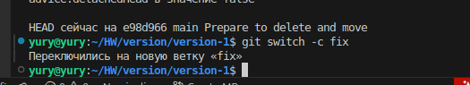
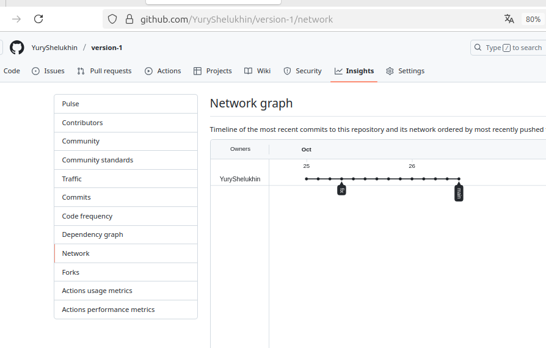
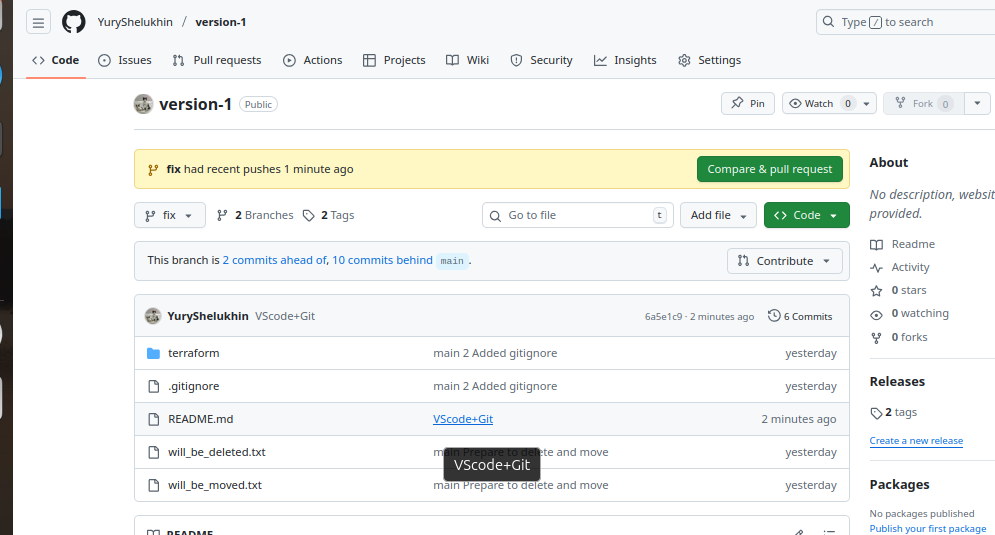

#  Домашнее задание к занятию «Основы Git» Шелухин Юрий

### Цель задания

В результате выполнения задания вы:

* научитесь работать с Git, как с распределённой системой контроля версий; 
* сможете создавать и настраивать репозиторий для работы в GitHub, GitLab и Bitbucket; 
* попрактикуетесь работать с тегами;
* поработаете с Git при помощи визуального редактора. 

### Чеклист готовности к домашнему заданию

1. Установлена консольная утилита для работы с Git.
2. Есть возможность зарегистрироваться на GitHub, GitLab.
3. Регистрация на Bitbucket не является обязательной. 


### Инструкция к заданию              

1. В личном кабинете отправьте на проверку ссылки на ваши репозитории.
2. Любые вопросы по решению задач задавайте в чате учебной группы.

------

## Задание 1. Знакомимся с GitLab и Bitbucket 

Из-за сложности доступа к Bitbucket в работе достаточно использовать два репозитория: GitHub и GitLab.

Иногда при работе с Git-репозиториями надо настроить свой локальный репозиторий так, чтобы можно было 
отправлять и принимать изменения из нескольких удалённых репозиториев. 

Это может понадобиться при работе над проектом с открытым исходным кодом, если автор проекта не даёт права на запись в основной репозиторий.

Также некоторые распределённые команды используют такой принцип работы, когда каждый разработчик имеет свой репозиторий, а в основной репозиторий пушатся только конечные результаты 
работы над задачами. 

### GitLab

Создадим аккаунт в GitLab, если у вас его ещё нет:

1. GitLab. Для [регистрации](https://gitlab.com/users/sign_up)  можно использовать аккаунт Google, GitHub и другие. 
2. После регистрации или авторизации в GitLab создайте новый проект, нажав на ссылку `Create a projet`. 
Желательно назвать также, как и в GitHub — `devops-netology` и `visibility level`, выбрать `Public`.
3. Галочку `Initialize repository with a README` лучше не ставить, чтобы не пришлось разрешать конфликты.
4. Если вы зарегистрировались при помощи аккаунта в другой системе и не указали пароль, то увидите сообщение:
`You won't be able to pull or push project code via HTTPS until you set a password on your account`. 
Тогда перейдите [по ссылке](https://gitlab.com/profile/password/edit) из этого сообщения и задайте пароль. 
Если вы уже умеете пользоваться SSH-ключами, то воспользуйтесь этой возможностью (подробнее про SSH мы поговорим в следующем учебном блоке).
5.   Перейдите на страницу созданного вами репозитория, URL будет примерно такой:
https://gitlab.com/YOUR_LOGIN/devops-netology. Изучите предлагаемые варианты для начала работы в репозитории в секции `Command line instructions`. 
6. Запомните вывод команды `git remote -v`.
7. Из-за того, что это будет наш дополнительный репозиторий, ни один вариант из перечисленных в инструкции (на странице вновь созданного репозитория) нам не подходит. Поэтому добавляем этот репозиторий, как дополнительный `remote`, к созданному репозиторию в рамках предыдущего домашнего задания:
`git remote add gitlab https://gitlab.com/YOUR_LOGIN/devops-netology.git`.
8. Отправьте изменения в новый удалённый репозиторий `git push -u gitlab main`.
9. Обратите внимание, как изменился результат работы команды `git remote -v`.

#### Как изменить видимость репозитория в  GitLab — сделать его публичным 

* На верхней панели выберите «Меню» -> «Проекты» и найдите свой проект.
* На левой боковой панели выберите «Настройки» -> «Основные».
* Разверните раздел «Видимость» -> «Функции проекта» -> «Разрешения».
* Измените видимость проекта на Public.
* Нажмите «Сохранить изменения».

### Bitbucket* (задание со звёздочкой) 

Это самостоятельное задание, его выполнение необязательно.
____

Теперь необходимо проделать всё то же самое с [Bitbucket](https://bitbucket.org/). 

1. Обратите внимание, что репозиторий должен быть публичным — отключите галочку `private repository` при создании репозитория.
1. На вопрос `Include a README?` отвечайте отказом. 
1. В отличии от GitHub и GitLab в Bitbucket репозиторий должен принадлежать проекту, поэтому во время создания репозитория 
надо создать и проект, который можно назвать, например, `netology`.
1. Аналогично GitLab на странице вновь созданного проекта выберите `https`, чтобы получить ссылку, и добавьте этот репозиторий, как 
`git remote add bitbucket ...`.
1. Обратите внимание, как изменился результат работы команды `git remote -v`.

Если всё проделано правильно, то результат команды `git remote -v` должен быть следующий:

```bash
$ git remote -v
bitbucket https://andreyborue@bitbucket.org/andreyborue/devops-netology.git (fetch)
bitbucket https://andreyborue@bitbucket.org/andreyborue/devops-netology.git (push)
gitlab	  https://gitlab.com/andrey.borue/devops-netology.git (fetch)
gitlab	  https://gitlab.com/andrey.borue/devops-netology.git (push)
origin	  https://github.com/andrey-borue/devops-netology.git (fetch)
origin	  https://github.com/andrey-borue/devops-netology.git (push)
```

Дополнительно можете добавить удалённые репозитории по `ssh`, тогда результат будет примерно такой:

```bash
git remote -v
bitbucket	git@bitbucket.org:andreyborue/devops-netology.git (fetch)
bitbucket	git@bitbucket.org:andreyborue/devops-netology.git (push)
bitbucket-https	https://andreyborue@bitbucket.org/andreyborue/devops-netology.git (fetch)
bitbucket-https	https://andreyborue@bitbucket.org/andreyborue/devops-netology.git (push)
gitlab	git@gitlab.com:andrey.borue/devops-netology.git (fetch)
gitlab	git@gitlab.com:andrey.borue/devops-netology.git (push)
gitlab-https	https://gitlab.com/andrey.borue/devops-netology.git (fetch)
gitlab-https	https://gitlab.com/andrey.borue/devops-netology.git (push)
origin	git@github.com:andrey-borue/devops-netology.git (fetch)
origin	git@github.com:andrey-borue/devops-netology.git (push)
origin-https	https://github.com/andrey-borue/devops-netology.git (fetch)
origin-https	https://github.com/andrey-borue/devops-netology.git (push)
```

Выполните push локальной ветки `main` в новые репозитории. 

Подсказка: `git push -u gitlab main`. На этом этапе история коммитов во всех трёх репозиториях должна совпадать. 

---

## Решение 1.

### Создание аккаунта в GitLab.

1. Зврегистрируемся в Gitlab.  

    

2-4. Создадим новый проект.

   
   
   

5. Перейдем на страницу созданного репозитория и изучим предлагаемые варианты для начала работы в репозитории в секции `Command line instructions`.     

  

6. Изучим команду `git remote -v`.  

  

Данная команда покажет список подключенных удаленных репозиториев.  

7. Добавим репозиторий gitlab, как дополнительный `remote`, к созданному репозиторию в рамках предыдущего домашнего задания:
`git remote add gitlab git@gitlab.com:yuryshelukhin-group/version-2.git`  
Затем просмотрим список подключенных репозиториев `git remote -v`.


Чтобы "пушить" на gitlab сделаем публичными последовательно на gitlab свою группу и репозиторий. Также установим для себя пароль на сайте gitlab.  


Чтобы не использовать SSH, привяжем remote на HTTPS.  
`git remote set-url gitlab https://gitlab.com/yuryshelukhin-group/version-2.git`

8. Сделаем изменения в файле README.md и закомиттим его. Далее отправим изменения в новый удалённый репозиторий `git push -gitlab main`.


9. Проверим вывод команды `git remote -v`


Также проверим факт выгрузки на gitlab.


---


## Задание 2. Теги

Представьте ситуацию, когда в коде была обнаружена ошибка — надо вернуться на предыдущую версию кода,
исправить её и выложить исправленный код в продакшн. Мы никуда не будем выкладывать код, но пометим некоторые коммиты тегами и создадим от них ветки. 

1. Создайте легковестный тег `v0.0` на HEAD-коммите и запуште его во все три добавленных на предыдущем этапе `upstream`.
2. Аналогично создайте аннотированный тег `v0.1`.
3. Перейдите на страницу просмотра тегов в GitHab (и в других репозиториях) и посмотрите, чем отличаются созданные теги. 
    * в GitHub — https://github.com/YOUR_ACCOUNT/devops-netology/releases;
    * в GitLab — https://gitlab.com/YOUR_ACCOUNT/devops-netology/-/tags;
    * в Bitbucket — список тегов расположен в выпадающем меню веток на отдельной вкладке. 

---

### Решение 2.  

1. Создадим легковестный тег `v0.0` на HEAD-коммите:  
`git tag v0.0`    

  

и запушим его в обе удаленные ветки.   

  
  
 
2.  Создадим аннотированный тег `v0.1`.    
`git tag -a v0.1 -m 'annotated tag'`    
Проверим список тегов.    

  

и вновь запушим тег в обе удаленные ветки.  

3. Перейдем на страницы просмотра тегов в Github и Gitlab для изучения.   

  
  
  
  
  

---


## Задание 3. Ветки   

Давайте посмотрим, как будет выглядеть история коммитов при создании веток.   
1. Переключитесь обратно на ветку `main`, которая должна быть связана с веткой `main` репозитория на `github`.  
2. Посмотрите лог коммитов и найдите хеш коммита с названием `Prepare to delete and move`, который был создан в пределах предыдущего домашнего задания.   
3. Выполните `git checkout` по хешу найденного коммита.   
4. Создайте новую ветку `fix`, базируясь на этом коммите `git switch -c fix`.  
5. Отправьте новую ветку в репозиторий на GitHub `git push -u origin fix`.  
6. Посмотрите, как визуально выглядит ваша схема коммитов: https://github.com/YOUR_ACCOUNT/devops-netology/network.   
7. Теперь измените содержание файла `README.md`, добавив новую строчку.  
8. Отправьте изменения в репозиторий и посмотрите, как изменится схема на странице https://github.com/YOUR_ACCOUNT/devops-netology/network и как изменится вывод команды `git log`.  

### Решение 3.  

1-2. Просмотрим список коммитов `git log --oneline`. Найдем хеш коммита с названием `Prepare to delete and move`  
   
    

3. Переключимся на этот коммит.    
`git checkout e98d966`    

    

4. Создадим новую ветку.    
`git switch -c fix`      

  

5. Отправим новую ветку в репозиторий на GitHub `git push -u origin fix`.  

  

6.  Посмотрим визуально схему коммитов.     

    

7. Изменим содержание файла `README.md`, добавив новую строчку, и отправим изменения в репозиторий.  

`git commit -am 'fix +change'`  
`git push -u origin fix`  

  

8. Посмотрим, как изменилась схема на странице Github и как изменил вывод команды `git log`.    

    
    

---


## Задание 4. Упрощаем себе жизнь  

Попробуем поработь с Git при помощи визуального редактора.   
1. В используемой IDE PyCharm откройте визуальный редактор работы с Git, находящийся в меню View -> Tool Windows -> Git.  
2. Измените какой-нибудь файл, и он сразу появится на вкладке `Local Changes`, отсюда можно выполнить коммит, нажав на кнопку внизу этого диалога.   
3. Элементы управления для работы с Git будут выглядеть примерно так:  
  
4. Попробуйте выполнить пару коммитов, используя IDE.   
[По ссылке](https://www.jetbrains.com/help/pycharm/commit-and-push-changes.html) можно найти справочную информацию по визуальному интерфейсу.   
Если вверху экрана выбрать свою операционную систему, можно посмотреть горячие клавиши для работы с Git.   
Подробней о визуальном интерфейсе мы расскажем на одной из следующих лекций.  
*В качестве результата работы по всем заданиям приложите ссылки на ваши репозитории в GitHub, GitLab и Bitbucket*.    
 

### Решение 4.  

1. Для проверки возможностей работы с Git в визуальном редакторе (я использую VSCode) изменим файл README.md.      
   
       
     

2. Выполним коммит с помощью интерфейса VScode.  

  

3. Изучим какие еще возможности предоставляет VScode: можно нажатием кнопок переходить между веткамии и между коммитами, вытягивать и отправлять информацию в удаленный репозиторий, просматривать изменения файлов, делать коммит с добавлением комментариев и т.д.    

    
    
    

4. Проверим фактическую выгрузку измений в удаленный репозиторий.   
   
  
  

* ссылки на удаленные репозитории:  
* https://github.com/YuryShelukhin/version-1  
* https://gitlab.com/yuryshelukhin-group/version-2
   


